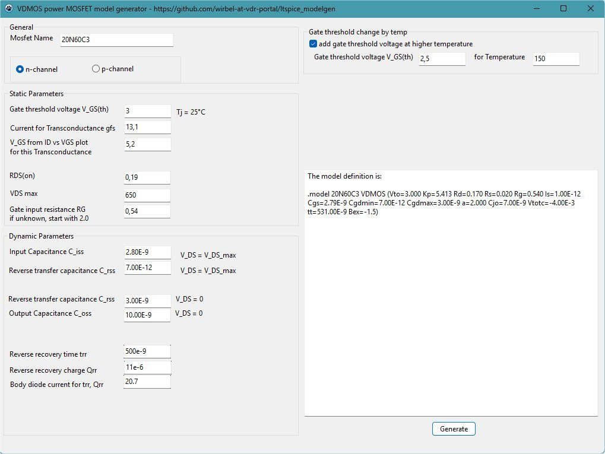

# ltspice_modelgen
A spice VDMOS model generator

# Howto

1. Get the datasheet of the MOSFET.
2. Enter the name of the MOSFET. Take care, that you choose n-channel or p-channel correctly. Most MOSFET of interest are n-channel.
3. From the datasheet, enter the Gate threshold voltage VGS(th), usually around 3..4 volts.
4. Lookup the transconductance gfs in the datasheet and find to which drain current this value belongs. Put this drain current in the next field, usually a few ampere.
5. Find the plot 'transfer characteristic', drain current ID vs VGS, and the VGS where at ~25°C the drain current from #4 flows. Put this voltage into the next field, this value should be greater than #3.
6. Enter the RDS(on) value from the datasheet. This value is from tens of an milliohms to several ohms.
7. Enter the rated VDS voltage, something from 20V to several hundreds of volts.
8. Enter the Gate input resistance RG. This is the series resistance of the gate and given in newer datasheets. If not known enter 1ohm or 2ohm.
9. Enter the input capacitance Ciss for the maximum drain-source voltage VDS. You need to find the plot of Ciss = f(VDS) and find the value for the highest drain-source voltage VDS.
10. Enter the reverse capacitance Crss for the maximum drain-source voltage VDS. You need to find the plot of Crss = f(VDS) and find the value for the highest drain-source voltage VDS.
11. Enter the reverse capacitance Crss for VDS = 0. You need to find the plot of Crss = f(VDS) and find the value for VDS = 0.
12. Enter the output capacitance Coss for VDS = 0. You need to find the plot of Coss = f(VDS) and find the value for VDS = 0.
13. optional: find the reverse recovery time trr of the MOSFETs body diode. Enter the value and lookup for which body diode current this value is defined.
14. if you did #13: Enter the reverse recovery charge Qrr of the MOSFETs body diode.
15. if you did #13: Enter the current value for trr, Qrr. If you skipped any of #13..#15, set all three values to zero.
16. find the plot 'transfer characteristics', showing ID = f(VGS). Lookup the Gate threshold voltage VGS(th) for the highest plotted temperature. The Gate threshold voltage is the voltage, where ID start to rise from zero. If you don't have this plot, uncheck the checkbox 'add gate threshold voltage at higher temperature'.
17. Press generate and copy the line.

# Usage in LtSpice
Press the button for a spice command and put the model line there. You can put the line somewhere on your schematic. It should look like

    .model 20N60C3 VDMOS (Vto=3.000 Kp=5.413 Rd=0.170 Rs=0.020 Rg=0.540 Is=1.00E-12 Cgs=2.79E-9 Cgdmin=7.00E-12 Cgdmax=3.00E-9 a=2.000 Cjo=7.00E-9 Vtotc=-4.00E-3 tt=531.00E-9 Bex=-1.5)

Put a new NMOS on the Schematic and change the modelname to the name of the MOSFET model.

