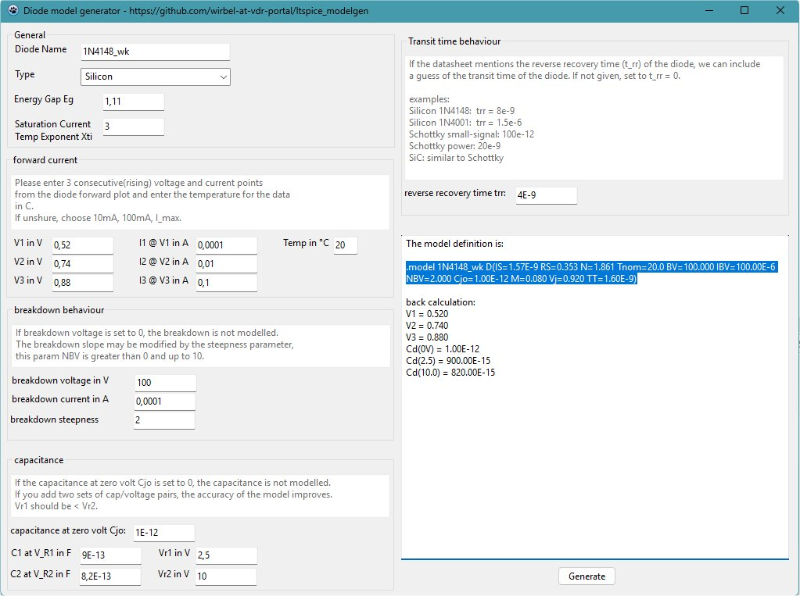

# ltspice_modelgen
A spice diode model generator

# Howto

1. Get the datasheet of the diode.
2. Enter the name and the type of the diode. Each type you change the diode type, a few settings will be changed to the defaults for this type.
So be shure to set the diode type first.
3. optional:  Set the energy gap Eg and the saturation current temperature exponent Xti. If there is no other information, leave them at the default values. Eg is important for the leakage current, Xti changes the temperature change of the leakage current.
4. Model the forward current: From the diodes Forward Current vs. Forward Voltage plot, get 3 pairs of Vf/If for the same temperature. These three point should be not near together, for example 0.01mA, 1mA, 100mA. If possible choose a curve near 27°C. Enter all three pairs as V1/I1, V2/I2, V3/I3 and the choosen temperature.
5. Model the breakdown behaviour: at least the breakdown voltage V(BR) and the breakdown current should be entered. If a breakdown plot is given in the datasheet, you may fine tune the model with the breakdown steepness parameter.
6. Model the diode capacitance: Locate the diode capacitance for VR = 0V, that means no diode voltage. Enter this value into the Cjo field. If no more data is available, set all four values for  C1/Vr1 and C2/Vr2 to zero. If you have an capacitance plot, enter from the curve two capacitance / reverse voltage points.
7. Model the transit time: the diodes transit time and the reverse recovery time are related. However, usually only reverse recovery time trr is given in datasheets. Therefore the transit time is guessed from the reverse recovery time. Enter the value of trr. If you have the transit time directly, enter a random value for trr now and add the correct transit time in the model line in the TT parameter. For Schottky and SiC, the transit time should be neglectable, you may set it to zero for those devices.

8. Press generate and copy the line.

# Usage in LtSpice
Press the button for a spice command and put the model line there. You can put the line somewhere on your schematic. It should look like

    .model 1N4148_wk D(IS=1.57E-9 RS=0.353 N=1.861 Tnom=20.0 BV=100.000 IBV=100.00E-6 NBV=2.000 Cjo=1.00E-12 M=0.080 Vj=0.920 TT=1.60E-9)

Put a new diode on the Schematic and change the modelname 'D' to the name of the diode.

